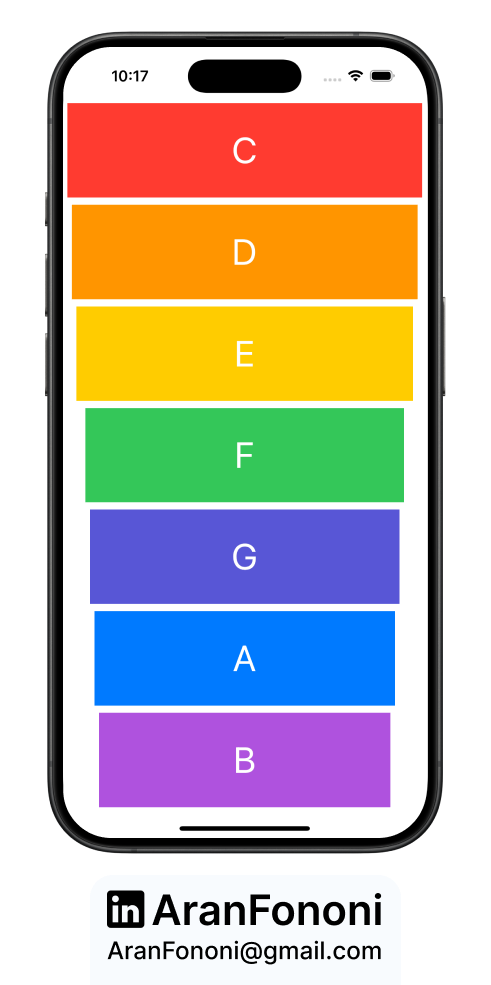
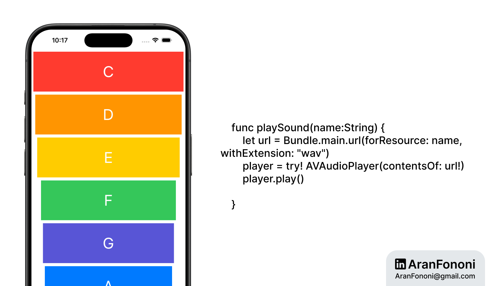

# Xylophone App

### Project for Section 7: **Sound and AVFoundation**  
This project was completed as part of Section 7 in the **Complete iOS Development Bootcamp** by Angela Yu.

## Project Overview
The **Xylophone App** is a fun music application that allows users to play different sounds by tapping on buttons. Each button plays a unique sound when pressed, providing a simple interactive experience.

## What I Learned
In this project, I focused on:
- **Using AVFoundation**: Learned how to use AVFoundation to play sound files.
- **Button Interaction**: Implemented feedback for button presses by changing their opacity.
- **Async Code**: Used `DispatchQueue` to create a delay in button feedback.

## Key Skills
- Working with AVAudioPlayer
- Handling user interactions with buttons
- Basic use of asynchronous programming in Swift

---

### Project Preview

---

### Footer

---

## Contact
For more information, feel free to reach out:  
- **Email**: [aranfononi@gmail.com](mailto:aranfononi@gmail.com)  
- **LinkedIn**: [Aran Fononi](https://www.linkedin.com/in/aran-fononi-18182b265)
